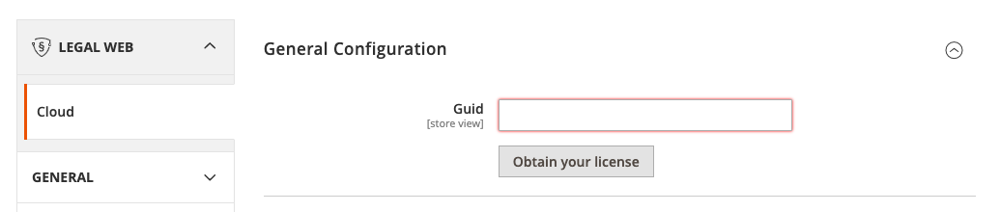

## Getting started
1. Run `composer require legalwebio/magento`
2. [Obtain your license](https://legalweb.io/?aff=4538)
3. Save your GUID inside the Legal web configuration section\
   
   
## Troubles/Feedback
Please [create an issue](https://github.com/legalwebio/magento/issues/new) if you have any troubles with the plugin or would like to give us any feedback. Thanks! 